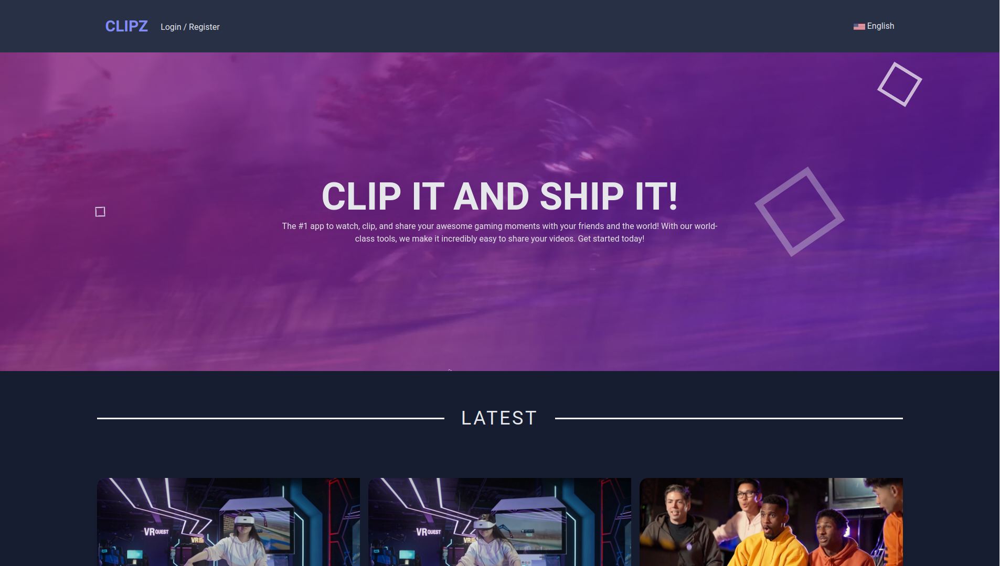

<h1 align="center">
  
</h1>

<p align="center">
  <a href="#-project">Project</a>&nbsp;&nbsp;&nbsp;|&nbsp;&nbsp;&nbsp;
  <a href="#-technologies">Technologies</a>&nbsp;&nbsp;&nbsp;|&nbsp;&nbsp;&nbsp;
  <a href="#-features">Features</a>&nbsp;&nbsp;&nbsp;|&nbsp;&nbsp;&nbsp;
  <a href="#-getting-started">Getting Started</a>
</p>

<p align="center">
 
  
</p>

<br>

<p align="center">
  
</p>

## 💻 Project

### Clipz - Share Your Awesome Gaming Moments!

Welcome to Clipz, the ultimate platform for gamers to share their most epic moments with the world! With our powerful tools and user-friendly interface, you can easily upload, edit, and showcase your gaming skills like never before.

Join our community of passionate gamers and share your videos with fellow enthusiasts, friends, and family. With Clipz, you can be confident that your videos will be seen by thousands of viewers, giving you the recognition you deserve!

Whether you're a beginner or a seasoned pro, Clipz has everything you need to take your gaming content to the next level. So why wait? Sign up today and start sharing your gaming adventures with the world!

---

## 🚀 Technologies

This project was developed using the following technologies:

- Angular
- WebAssembly
- Rust
- FFMPEG
- Video.js
- Firebase
- Tailwind CSS

---

## 🤖 Features

### Clipz offers the following features:

- **Register**: users can create an account to access the app's functionalities.

- **Login**: users can log in to their account to access their videos and profile.

- **Upload Videos**: users can upload their gaming videos to the app.

- **Generate Thumbnail**: the app automatically generates a thumbnail for each video uploaded by the user.

- **Delete Videos**: users can delete their videos from the app.

- **Edit Title**: users can edit the title of their videos.

- **Infinity Scroll**: the app supports infinity scroll, allowing users to navigate through the videos with ease.

- **Authentication**: the app uses Firebase for authentication, ensuring secure access to user data.

---

## 👨‍💻 Getting Started

To get started with Clipz, follow the steps below:

### Installation

Clone the repository:

```
git clone https://github.com/leeodesign/clipz.git
```

cd clipz

**Install the dependencies:**

```
npm install
```

## Usage

Start the server:

```
ng serve
```

Open your browser and go to http://localhost:4200/

---

Course :wave: [Complete Angular Developer in 2023: Zero to Mastery!](https://www.udemy.com/course/complete-angular-developer-zero-to-mastery/)
